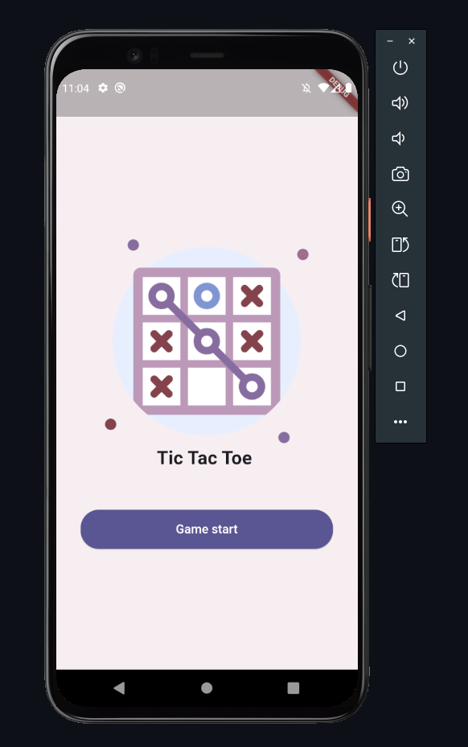
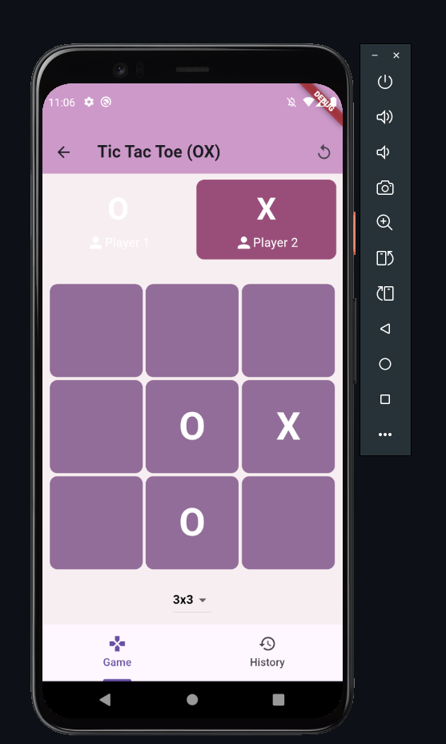
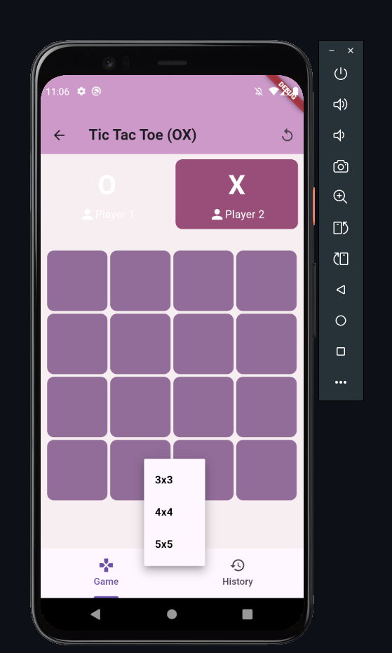
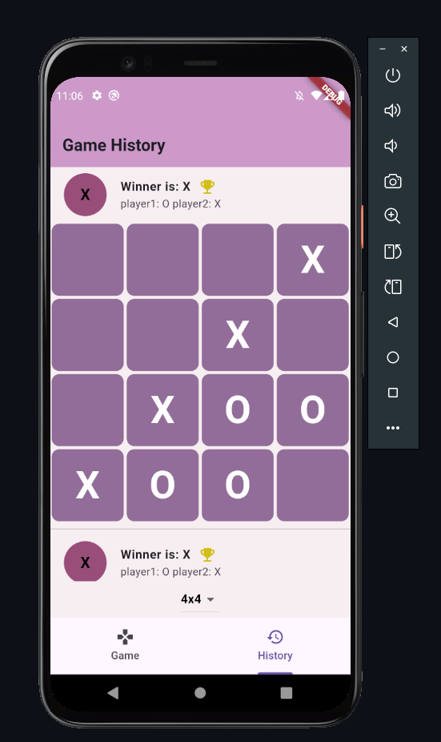

# Tic-Tac-Toe Game with Firebase Integration

## Overview

This project is a simple Tic-Tac-Toe game built with Flutter and Firebase. The game includes the functionality for a dynamic grid size (3x3, 4x4, 5x5), and it tracks the game's history using Firebase Firestore. It allows the user to play the game, save the history of games, and view the game history in real-time.

## Features

- **Dynamic Grid Size:** The grid size can be dynamically changed (3x3, 4x4, or 5x5).
- **Real-Time History:** The history of the games is stored in Firebase Firestore and can be viewed by the user.
- **Winner Declaration:** Once a winner is found or the game ends in a draw, a dialog box displays the result.
- **Play Again and Reset Options:** The game can be restarted after a game ends.
  
## Technologies Used

- **Flutter:** The app is developed using Flutter, a UI toolkit for building natively compiled applications for mobile, web, and desktop.
- **Firebase:** Firebase Firestore is used to store the game history.
- **GetX:** Used for state management, making it easier to update UI and manage states like grid size and player turns.

## Example App

Here is an example of the game in action:

1. **Main App Screen:**

    

2. **Game Page:**

    

3. **Game in Progress:**

    

4. **History Screen:**

    

## Installation

1. **Clone the repository:**

    ```bash
    git clone <repository-url>
    cd <project-directory>
    ```

2. **Install Flutter dependencies:**

    Make sure you have Flutter installed on your machine. If not, follow the instructions on the official site: [Flutter Installation](https://flutter.dev/docs/get-started/install).

    After cloning the repo, run:

    ```bash
    flutter pub get
    ```

3. **Set up Firebase:**

    - Go to the [Firebase Console](https://console.firebase.google.com/) and create a new Firebase project.
    - Add Firebase to your Flutter app by following the instructions in the [FlutterFire documentation](https://firebase.flutter.dev/docs/overview).
    - Download the `google-services.json` file and place it in the `android/app` directory.

4. **Run the App:**

    Connect your device or start an emulator, then run the following command:

    ```bash
    flutter run
    ```

## Code Breakdown

### `Controller.dart`

This class manages the game's state and interactions with Firebase. It handles:
- Grid size configuration (3x3, 4x4, or 5x5).
- Player turn management (X or O).
- Saving the game history to Firebase Firestore.
- Checking for winners and handling draws.

### `DisplayHistory.dart`

This class displays the game history from Firebase Firestore. It shows the previous games, the winner, and the game's grid as it was played. The user can also change the grid size here to view different historical games.

### Firebase Firestore Structure

The Firestore database is structured as follows:
- `Game_history` collection contains documents with:
  - `createdAt`: Timestamp when the game was played.
  - `history`: The winner or "Draw".
  - `log3`, `log4`, or `log5`: The game logs depending on the grid size.

### Example Game History Document

A sample document in the `Game_history` collection might look like this:

```json
{
  "createdAt": "2025-02-16T12:30:00Z",
  "history": "X",
  "log3": ["X", "O", "X", "O", "X", "O", "X", "O", "X"]
}
